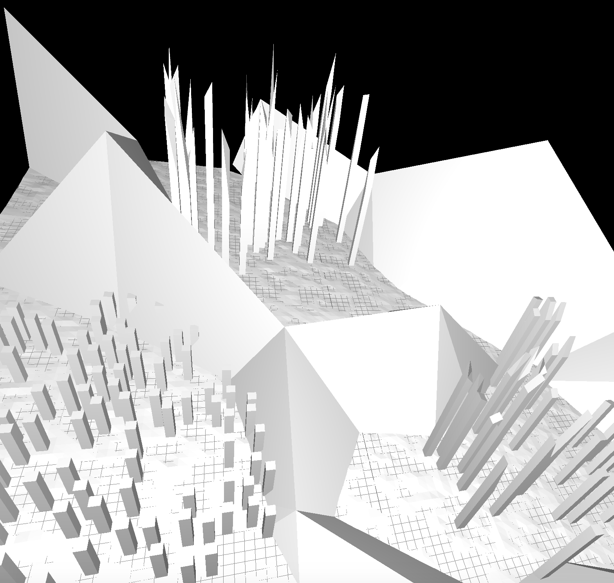

# CG Projekt
**R. Schwarzentruber, M. Nebroj, S. Ineichen**

## Einleitung
Ziel dieses Projekts ist es eine randomisierte Stadt mit Houdini zu generiern. Die generierte Stadt soll anschliessend
in einem Browser gerendert werden und zudem soll eine Navigation durch die Stadt möglich sein.
Optional soll es möglich sein, weitere Objekte in die Webapp einzubinden um jegliche `*.obj` Files anzeigen zu können.

## Umsetzung
### Stadt mit Houdini
* **Komponent Stadt**
    Es wurde ein Stadt Komponent erzeugt der verschiedene Parameter hat.
    Dazu gehören die Grundfläche, Anzahl Häuser, Grösse und Konturen.

* **Komponent Ground & Mountain**
    Der Ground & Mountain Komponent besteht aus einem Grid welches der Boden darstellt und einem Grid,
    welches die Berge darstellt. Beide Grids werden schlussendlich zu einem verschmolzen.

* **Zusammenführung**
    Für das Finale Objekt wurden 3 Stadt Komponenten und 1 Ground & Mountain Komponent zusammengeführt
    Die Stadt Objekte haben jeweils andere Parameter um verschiedene Städte zu erzeugen.

### Webapp mit Three.js
Die Webapplikation ist eigentlich ein `*.obj` Viewer. Man kann mithilfe einer Konfiguration die
unterstützten `*.obj` Files definieren. Auf der Webseite kann dann mit einem Dropdown das `*.obj` File
gewählt werden. Es kann zusätlich die Bewegungsgeschwindikeit eingestellt werden. Die Kamera
Attribute werden auch dargestellt.

#### Bewegung
| Position      	| Rotation               	|
|---------------	|------------------------	|
| W - Vorwärts  	| F - Nach Links drehen  	|
| S - Rückwärts 	| H - Nach Rechts drehen 	|
| A - Links     	| T - Nach Oben schauen  	|
| D - Rechts    	| G - Nach Unten schauen 	|
| Q - Hoch      	|                        	|
| E - Runter    	|                        	|

\pagebreak

## Tools

### Houdini
Houdini ist ein Werkzeug um 3D Szenen zu erzeugen. Es kann für Film & TV, Games, Motion Graphics und auch VR
genutzt werden. Extrem spanned sind vorallem die möglichkeiten welche durch die Nodes basierte verarbeitung
ermöglicht werden. So können zum Beispiel einfach Objekte verschmolzen werden. Mehr zum Tool
kann auf der SideFX Webseite erfahren werden (Link unter Credits).

### Three.js
THREE.js ist eine Javascript Bibliothek welche für 3D Darstellungen im Browser verwendet werde kann.
Sie basiert auf WebGL hat aber von Haus aus viele nette Funktionen welche das Leben in der 3D
Programmierung extrem erleichtern.

### Python (Webserver)
Wir verwendeten einen mini Python Webserver um lokal zu entwickeln, um nicht
zwingend auf Webstorm angewiesen zu werden.

## Webapp Starten
1. `../hslu-cg-houdini/webapp` mit Webstorm öffnen und index.html aufmachen
    oder
2. `../hslu-cg-houdini/webapp/localwebserver.py` mit Python starten und http://localhost:8080
    in einem Webbrowser öffnen

## Houdini Projekt bearbeiten
Das Houdini Projekt befindet sich im Ordner `../hslu-cg-houdini/houdini`.
Wenn die Webapp angepasst werden soll muss in Houdini *.obj Export gemacht werden.
Dafür wird der gewünschte Knoten selektiert und mit einem Rechts-Klick kann dann
ein `*.obj` File gespeichert werden. Die `*.obj` Files sind im ordner `../hslu-cg-houdini/webapp/obj`
abgelegt und werden im File `../hslu-cg-houdini/webapp/config.json` referenziert.

## Credits

### THREE.js

* [Webseite THREE.js](https://threejs.org)

### THREE.js *.obj Loader

* [*.obj Loader](https://threejs.org/docs/#examples/loaders/OBJLoader)

### Houdini

* [Dokumentation SideFX](https://www.sidefx.com/tutorials/)

### Pandoc

* PDF generierung von Markdown Files

    [Webseite](https://pandoc.org)